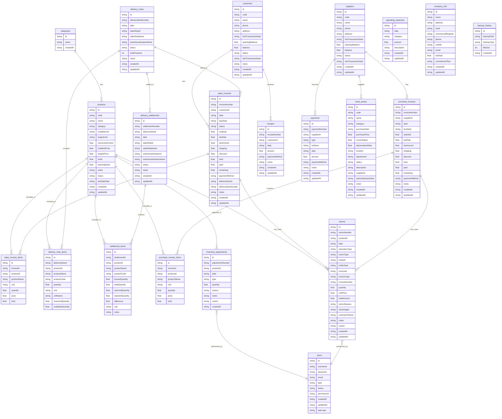

# مخطط قاعدة البيانات - نظام أسيل (ERD)

## مخطط العلاقات الكامل (Entity Relationship Diagram)

## ملخص الجداول والعلاقات

### الجداول الأساسية (5 جداول)
1. **categories** - الأصناف
2. **products** - المنتجات
3. **customers** - العملاء
4. **suppliers** - الموردين
5. **users** - المستخدمين

### جداول المبيعات (4 جداول)
6. **sales_invoices** - فواتير المبيعات
7. **sales_invoice_items** - عناصر فواتير المبيعات
8. **delivery_notes** - أذون الصرف
9. **delivery_note_items** - عناصر أذون الصرف

### جداول التسويات (2 جدول)
10. **delivery_settlements** - التسويات
11. **settlement_items** - عناصر التسويات

### جداول المشتريات (2 جدول)
12. **purchase_invoices** - فواتير المشتريات
13. **purchase_invoice_items** - عناصر فواتير المشتريات

### جداول السندات (2 جدول)
14. **receipts** - سندات القبض
15. **payments** - سندات الصرف

### جداول الجرد والمرتجعات (2 جدول)
16. **inventory_adjustments** - عمليات الجرد
17. **returns** - المرتجعات

### جداول الأصول والمصاريف (2 جدول)
18. **fixed_assets** - الأصول الثابتة
19. **operating_expenses** - المصاريف التشغيلية

### جداول النظام (2 جدول)
20. **company_info** - معلومات الشركة
21. **backup_history** - سجل النسخ الاحتياطي

---

**المجموع: 21 جدول**

## ملاحظات مهمة

### العلاقات الرئيسية:
- **products** هو الجدول المركزي الذي يرتبط بمعظم الجداول الأخرى
- **customers** يرتبط بـ **sales_invoices** و **receipts**
- **suppliers** يرتبط بـ **purchase_invoices** و **payments** و **fixed_assets**
- **delivery_notes** يرتبط بـ **sales_invoices** و **delivery_settlements**
- **users** يرتبط بـ **inventory_adjustments** و **returns**

### Foreign Keys:
- جميع العلاقات محمية بـ Foreign Key Constraints
- بعض الجداول تستخدم `ON DELETE CASCADE` لحذف العناصر المرتبطة تلقائياً
- جدول **returns** له علاقات متعددة مع **sales_invoices** و **purchase_invoices**

